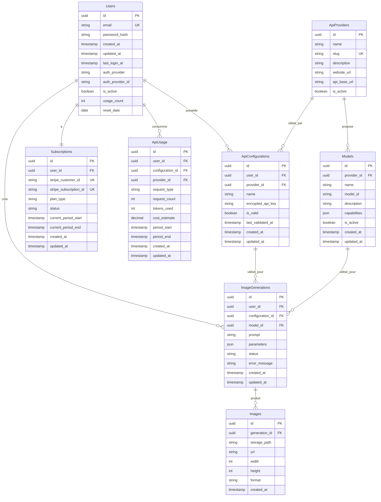

# Architecture de Base de Données pour Bambi AI

## Vue d'ensemble

Ce document présente l'architecture de base de données complète pour Bambi AI, une application de génération d'images BYOK (Bring Your Own Key) permettant aux utilisateurs de générer des images via des prompts en utilisant leurs propres clés API.

## Schéma de Base de Données

### Diagramme Entité-Relation

## Description Détaillée des Tables

### 1. Users

Stocke les informations des utilisateurs et leurs données d'authentification.

| Colonne | Type | Description |
|---------|------|-------------|
| id | uuid | Identifiant unique (PK) |
| email | string | Adresse email (unique) |
| password_hash | string | Hash du mot de passe |
| created_at | timestamp | Date de création |
| updated_at | timestamp | Date de mise à jour |
| last_login_at | timestamp | Dernière connexion |
| auth_provider | string | Fournisseur d'authentification (email, Google, GitHub) |
| auth_provider_id | string | ID externe du fournisseur d'authentification |
| is_active | boolean | Statut du compte |
| usage_count | integer | Nombre de générations utilisées (pour le plan gratuit) |
| reset_date | date | Date de réinitialisation du compteur d'utilisation |

### 2. Subscriptions

Gère les abonnements des utilisateurs et les informations de paiement.

| Colonne | Type | Description |
|---------|------|-------------|
| id | uuid | Identifiant unique (PK) |
| user_id | uuid | Référence à l'utilisateur (FK) |
| stripe_customer_id | string | ID client Stripe (unique) |
| stripe_subscription_id | string | ID abonnement Stripe (unique) |
| plan_type | string | Type de plan (gratuit, premium) |
| status | string | Statut de l'abonnement (actif, annulé, etc.) |
| current_period_start | timestamp | Début de la période actuelle |
| current_period_end | timestamp | Fin de la période actuelle |
| created_at | timestamp | Date de création |
| updated_at | timestamp | Date de mise à jour |

### 3. ApiProviders

Stocke les informations sur les différents fournisseurs d'API de génération d'images.

| Colonne | Type | Description |
|---------|------|-------------|
| id | uuid | Identifiant unique (PK) |
| name | string | Nom du fournisseur (OpenAI, Google, xAI) |
| slug | string | Identifiant court (openai, google, xai) (unique) |
| description | string | Description du fournisseur |
| website_url | string | URL du site web |
| api_base_url | string | URL de base de l'API |
| is_active | boolean | Statut d'activation |

### 4. Models

Stocke les informations sur les modèles disponibles pour chaque fournisseur.

| Colonne | Type | Description |
|---------|------|-------------|
| id | uuid | Identifiant unique (PK) |
| provider_id | uuid | Référence au fournisseur (FK) |
| name | string | Nom du modèle (DALL-E 3, Imagen, etc.) |
| model_id | string | Identifiant technique du modèle |
| description | string | Description du modèle |
| capabilities | json | Capacités du modèle (JSON) |
| is_active | boolean | Statut d'activation |
| created_at | timestamp | Date de création |
| updated_at | timestamp | Date de mise à jour |

### 5. ApiConfigurations

Stocke les configurations API des utilisateurs de manière sécurisée.

| Colonne | Type | Description |
|---------|------|-------------|
| id | uuid | Identifiant unique (PK) |
| user_id | uuid | Référence à l'utilisateur (FK) |
| provider_id | uuid | Référence au fournisseur (FK) |
| name | string | Nom de la configuration |
| encrypted_api_key | string | Clé API chiffrée (AES-256) |
| is_valid | boolean | Statut de validité de la clé |
| last_validated_at | timestamp | Dernière validation |
| created_at | timestamp | Date de création |
| updated_at | timestamp | Date de mise à jour |

### 6. ImageGenerations

Stocke l'historique des générations d'images.

| Colonne | Type | Description |
|---------|------|-------------|
| id | uuid | Identifiant unique (PK) |
| user_id | uuid | Référence à l'utilisateur (FK) |
| configuration_id | uuid | Référence à la configuration API utilisée (FK) |
| model_id | uuid | Référence au modèle utilisé (FK) |
| prompt | string | Texte du prompt |
| parameters | json | Paramètres de génération (JSON) |
| status | string | Statut de la génération |
| error_message | string | Message d'erreur (si applicable) |
| created_at | timestamp | Date de création |
| updated_at | timestamp | Date de mise à jour |

### 7. Images

Stocke les métadonnées des images générées.

| Colonne | Type | Description |
|---------|------|-------------|
| id | uuid | Identifiant unique (PK) |
| generation_id | uuid | Référence à la génération (FK) |
| storage_path | string | Chemin de stockage de l'image |
| url | string | URL publique de l'image |
| width | integer | Largeur de l'image |
| height | integer | Hauteur de l'image |
| format | string | Format de l'image |
| created_at | timestamp | Date de création |

### 8. ApiUsage

Suit l'utilisation des API par utilisateur et par configuration.

| Colonne | Type | Description |
|---------|------|-------------|
| id | uuid | Identifiant unique (PK) |
| user_id | uuid | Référence à l'utilisateur (FK) |
| configuration_id | uuid | Référence à la configuration API (FK) |
| provider_id | uuid | Référence au fournisseur (FK) |
| request_type | string | Type de requête (génération, validation, etc.) |
| request_count | integer | Nombre de requêtes |
| tokens_used | integer | Nombre de tokens utilisés (si applicable) |
| cost_estimate | decimal | Estimation du coût (si applicable) |
| period_start | timestamp | Début de la période |
| period_end | timestamp | Fin de la période |
| created_at | timestamp | Date de création |
| updated_at | timestamp | Date de mise à jour |

## Stratégies de Sécurité et Conformité

### Chiffrement des Données Sensibles

- Les clés API sont chiffrées avec AES-256 avant stockage dans la base de données
- Utilisation d'une clé de chiffrement maître stockée dans un gestionnaire de secrets (AWS KMS, Vault)
- Rotation périodique des clés de chiffrement
- Les clés API ne transitent jamais en clair côté frontend

### Gestion des Autorisations

- Utilisation des Row Level Security (RLS) de Supabase pour limiter l'accès aux données
- Politiques d'accès précises pour chaque table
- Principe du moindre privilège pour les accès à la base de données
- Séparation des rôles et responsabilités

### Conformité RGPD

- Stockage minimal des données personnelles
- Mécanisme de suppression des données à la demande de l'utilisateur
- Journal des consentements et des modifications de données
- Politique de conservation des données claire et transparente

## Stratégies d'Indexation et Performance

### Indexes Principaux

- Users : index sur email, auth_provider, usage_count
- Subscriptions : index sur user_id, stripe_customer_id, current_period_end
- ApiConfigurations : index sur user_id, provider_id, (user_id, provider_id)
- ImageGenerations : index sur user_id, created_at
- ApiUsage : index sur user_id, configuration_id, period_start

### Stratégies de Mise en Cache

- Mise en cache des données utilisateur et abonnement
- Mise en cache des fournisseurs API et modèles (données relativement statiques)
- Utilisation de Redis pour le cache distribué
- Invalidation intelligente du cache

## Intégration des API de Génération d'Images

### OpenAI (DALL-E 2 et 3)

- Authentification par clé API
- Paramètres spécifiques stockés dans le champ capabilities de la table Models
- Suivi des quotas et limites via la table ApiUsage
- Gestion des erreurs spécifiques à OpenAI

### Google Imagen (via Vertex AI)

- Authentification via clé API Google Cloud
- Paramètres spécifiques à Imagen stockés dans capabilities
- Suivi des quotas et coûts Google Cloud
- Support pour les fonctionnalités spécifiques à Imagen

### xAI Grock

- Authentification par clé API
- Paramètres et capacités spécifiques à Grock
- Suivi de l'utilisation et des limites
- Gestion des erreurs spécifiques à xAI

## Stratégies de Mise à l'Échelle

- Partitionnement de la table ImageGenerations par date
- Partitionnement de la table Images par utilisateur
- Utilisation de vues matérialisées pour les requêtes complexes fréquentes
- Plan de migration vers des instances dédiées pour les besoins de performance accrus
- Stratégie de nettoyage et d'archivage des données historiques